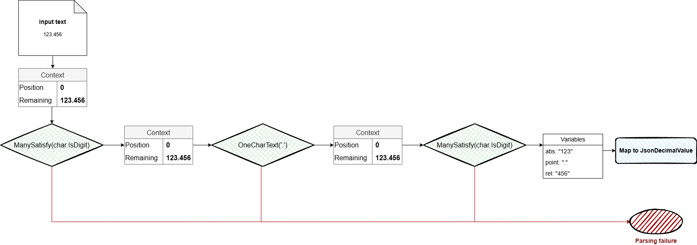

[](https://github.com/rflechner/EasyParsing/actions/workflows/dotnet.yml)

# EasyParsing

C# lite parser combinator helping to create parsers easily.

**Benefits**
- It's easy to create parsers with combinators
- Extensible
- Good performances
- Lightweight  library

## Installation

You can install EasyParsing via NuGet :

```bash
dotnet add package EasyParsing --source https://nuget.pkg.github.com/rflechner/

```

## Examples

This project contains 2 examples.

- [A simple JSON parser](src/EasyParsing.Samples.Json/readme.md). 
- [A simple Markdown parser](src/EasyParsing.Samples.Markdown/readme.md). 


### Quick example

Here is a simple example of creating a parser to recognize integers.

```csharp
using EasyParsing;
using static EasyParsing.Dsl.Parse;

IParser<int> IntegerParser =
    from digits in ManySatisfy(char.IsDigit)
    select int.Parse(digits);

var result = IntegerParser.Parse("12345");

if (result.Success)
{
    Console.WriteLine($"Parsed number: {result.Result}");
}
else
{
    Console.WriteLine($"Parsing failed: {result.FailureMessage}");
}

```


Then for static methods helpers, add using:

```C#
using static EasyParsing.Dsl.Parse;
```

## Technical details

### Concept of parser combinator

The main goal is to combine multiples small parsers to create a more complex one.

For example, if we want to parse JSON:

```json
{
  "name": "Romain", 
  "age": 39
}
```

We can decompose the problem in multiples steps:
- detecting objects starts `{` (_followed by potentials spaces_)
- parse __quoted string__ for properties (_followed by potentials spaces_)
- parse __value assigment__ character `:` (_followed by potentials spaces_)
- parse __quoted string__ for values (_followed by potentials spaces_)
- handle multiple properties assignment separated by `,` (_followed by potentials spaces_)
- detecting objects ends `}` (_followed by potentials spaces_)

Then we can create a **_parser pipeline_**.

A parser implements interface `IParser<T>` and returns a `IParsingResult<T>`.

`IParsingResult<T>` contains current context and failure or success information.

A pipeline of parsers will use previous `IParsingResult<T>` to known if parsing should continue or if parsing has failed.


#### Illustration of a small case

Following case is a parsing a decimal value.
We want to parse an `integer`, then a `point`, then as `integer`.

We create 3 parsers, then we combine all.

If one parser fails, then the result of combined parser will be a failure.



###### In C#

We define a model in the AST (Abstract Syntax Tree) for JSON decimal value:

```C#
public sealed record JsonDecimalValue(decimal Value) : JsonValue;
```

The parser for will try to extact decimal value from `"123.456"`.
`123` will be absolute value.
`.` will be separator.
`456` will be relative value.

```C#
IParser<JsonDecimalValue> JsonDecimalValueParser =
        from abs in ManySatisfy(char.IsDigit)
        from point in OneCharText('.')
        from rel in ManySatisfy(char.IsDigit)
        select new JsonDecimalValue(decimal.Parse($"{abs}.{rel}", NumberStyles.AllowDecimalPoint, CultureInfo.InvariantCulture));
```

### Coding

Following case, is describing big steps of json parsing like in [JsonParser.cs](src/EasyParsing.Samples.Json/JsonParser.cs). 

#### Objects start and end

We can match only one char `{` and __ignore__ all following spaces.  
For this, we can create a small parser.

```C#
IParser<string> StartObject = OneCharText('{') >> SkipSpaces();
```

Operator `>>` will combine both parsers and __ignore__ second result.

For the end, this is the same job:

```C#
IParser<string> EndObject = OneCharText('}') >> SkipSpaces();
```

#### Quoted strings

Quoted string parsing can be difficult if we handle quotes escaping.

`Parse.CreateStringParser(char quoteChar)` can help to create basic quoted strings parsers.

Then `Parse` static class contains

```C#
public static readonly IParser<string> QuotedTextParser = CreateStringParser('\'') | CreateStringParser('"');
```

The operator `|` will try to run first parser, if first parser fails then it tries to run second.   
So if parser `CreateStringParser('\'')` fails, we try to parse double-quoted string with `CreateStringParser('"')`.

#### Monad

A linq provider monad allow to chain parsers and map results to an object model.


After creating each value parser, we create a parser which make a choice between each of them.

```C#
internal static IParser<JsonValue> ValueParser =>
    JsonStringValueParser.Cast<JsonStringValue, JsonValue>()
    | JsonBoolValueParser
    | JsonDecimalValueParser
    | JsonLongValueParser
    | JsonObjectParser
    | JsonArrayParser;
```

Then we can hide the logic to the consumer of our JSON parser with a method like:

```C#
public static JsonValue ParseJson(string text)
{
    var result = ValueParser.Parse(text);
    
    if (!result.Success)
        throw new JsonParsingException(result.FailureMessage);
    
    if (result.Result == null)
        throw new JsonParsingException("Could not parse JSON.");
    
    return result.Result;
}
```
